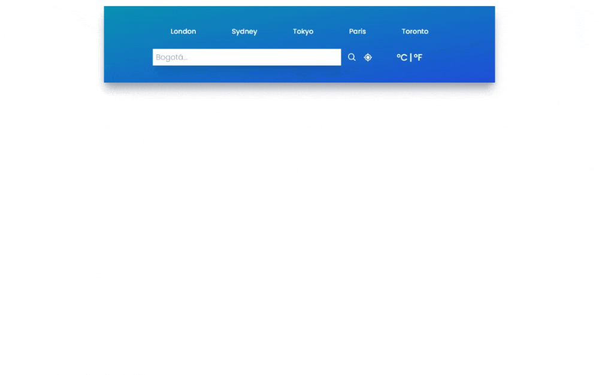

# Instrucciones

Este proyecto se realiza siguiendo las instrucciones del [este videotutorial](https://www.youtube.com/watch?v=SAE_TN2mD3Q&t=576s)

Se usa la API de clima en [openweathermap.org](https://openweathermap.org/api)



## Tecnologías usadas
- **HTML, CSS y Javascript**
- **Vite**
- **ReactJs**
- **Tailwind**
- **luxon:** Para dar formato a las fechas y horas
- **react-icons:** Para mejorar la apariencia de la aplicación con iconos
- **react-toastify:** Para notificar al usuario los pocesos ejecutados

## Ejecutar el proyecto con Vite
Al usar la herramienta Vite, este proyecto se puede ejecutar con el siguiente comando

``` bash
$ npm run dev
```

## Enseñanzas del proyecto
- 💚 Uso interesante de Tailwind para maquetar y dar estilos a la aplicación.
- 💚 Pasos interesantes para instalar Tailwind en una aplicación React.
- 💢 El proceso de creación del servicio que se usa para obtener información del API difícil de entender.
- 💢 El API del clima y su documentación es difícil de entender y de usar, se requiere crear una cuenta.
- ⚡ En general el proyecto es interesante, usa estados y efectos, separa la aplicacion en componentes y se puede practicar el pasar propiedades a los componentes y recibir acciónes hacia la aplicación principal.
